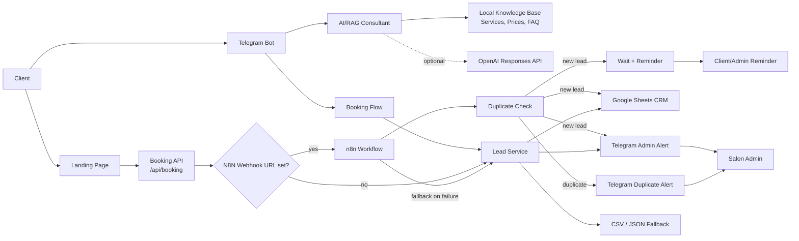
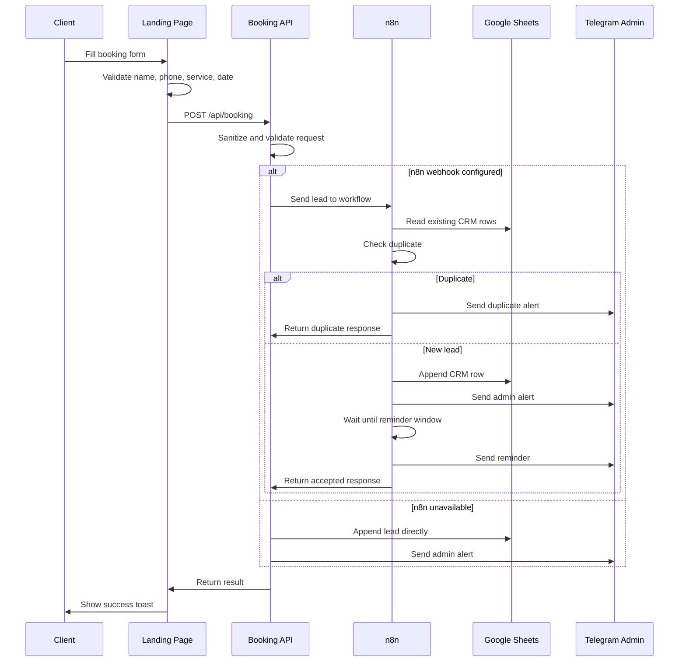
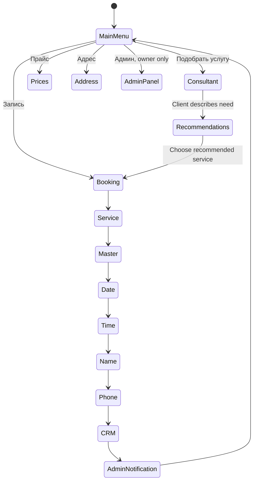

# Architecture

## System Overview

## Landing Form Flow

## Telegram Bot Flow

## Runtime Modes

| Mode | Use Case | Entry Point |
| --- | --- | --- |
| Local site | Test landing and booking API | `npm run site` |
| Local bot | Test Telegram bot with polling | `npm run bot` |
| Vercel site/API | Deploy landing and serverless endpoints | `/api/booking`, `/api/telegram` |
| n8n local | Test visual workflow | `npx n8n` |
| n8n production | Real automation runner | production webhook URL |

## Data Destinations

| Destination | Purpose |
| --- | --- |
| Google Sheets | Main CRM table for demo/client use |
| CSV fallback | Local backup when Google credentials are missing |
| JSON archive | Local admin panel source for recent leads and statuses |
| Telegram | Admin alerts, duplicate alerts, reminders |
